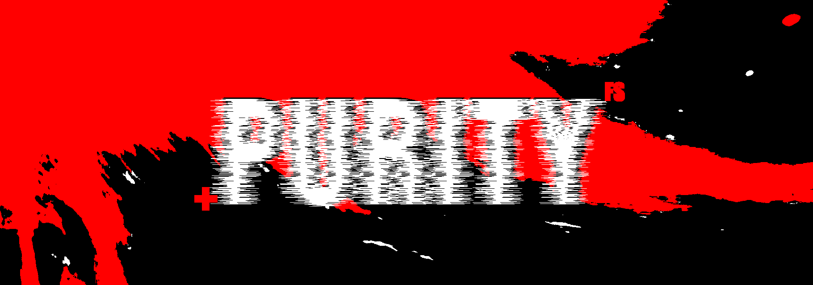

# Purity-FS



An advanced, dependency-free Virtual Filesystem (VFS) and Cryptographic Storage Engine engineered entirely from bedrock principles in pure C++20.

---

## 🔬 System Attributes
* **Zero Dependency Bloat:** Compiled straight to bare-metal using only standard C++ system libraries (`<fstream>`, `<vector>`, `<memory>`).
* **Binary Serialization:** Operates entirely within a single high-performance static host disk chunk file.
* **On-Chain Cryptography:** Implements a direct custom bit-shifting cluster obfuscation matrix loop.
* **Interactive CLI Shell Loop:** Natively processes terminal instructions (`vfs_mkdir`, `vfs_import`, `vfs_export`) via isolated shell scripts.

---

## 🛠 Building from Source
Requires a compiler matching the native `C++20` standard profile.
```bash
git clone https://github.com/alistairfontaine/Purity-FS
cd Purity-FS
make
./purity-fs
```
